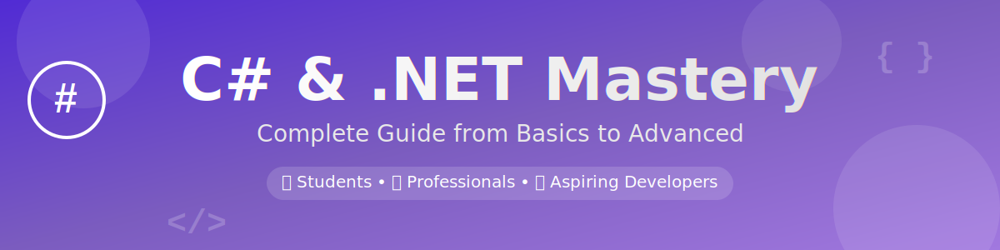

<div align="center">

<!-- Banner -->


<br/><br/>


**A comprehensive C# learning repository covering everything from fundamentals to real-world applications**

[🌟 Star this repo](https://github.com/ZainulabdeenOfficial/CSharp_Latest) • [🐛 Report Bug](https://github.com/ZainulabdeenOfficial/CSharp_Latest/issues) • [✨ Request Feature](https://github.com/ZainulabdeenOfficial/CSharp_Latest/issues)

</div>

---

## 📖 Table of Contents

- [About This Repository](#-about-this-repository)
- [Who Is This For?](#-who-is-this-for)
- [Topics Covered](#-topics-covered)
- [Detailed Learning Path](#-detailed-learning-path)
- [Getting Started](#-getting-started)
- [Project Structure](#-project-structure)
- [Prerequisites](#-prerequisites)
- [Real-World Project](#-real-world-project)
- [Interview Preparation](#-interview-preparation)
- [Timestamps & Navigation](#-timestamps--navigation)
- [Contributing](#-contributing)
- [License](#-license)
- [Connect With Me](#-connect-with-me)

---

## 🎯 About This Repository

Welcome to **CSharp_Latest** – your complete guide to mastering C# and .NET Framework! This repository is designed to take you from absolute beginner to confident developer with practical examples, real-world projects, and interview preparation materials.

### ✨ Key Features

- 📚 **Comprehensive Content**: From basics to advanced topics
- 💻 **Hands-on Examples**: Real code you can run and modify
- 🎓 **Structured Learning Path**: Step-by-step progression
- 🚀 **Real-World Project**: End-to-end application development
- 💼 **Interview Ready**: Questions and tips for job seekers
- ⏱️ **Easy Navigation**: Timestamps for quick access

---

## 👥 Who Is This For?

🎯 **Perfect for:**

- 👨‍🎓 **Students** learning C# for the first time
- 💼 **Working Professionals** transitioning to .NET
- 🚀 **Aspiring .NET Developers** building their portfolio
- 🔄 **Developers** refreshing their C# knowledge
- 🎯 **Job Seekers** preparing for .NET interviews

---

## 📚 Topics Covered

### 🔹 Module 1: Introduction to C# & .NET Framework
- History and evolution of C#
- .NET Framework vs .NET Core vs .NET 5/6+
- Setting up development environment (Visual Studio / VS Code)
- Your first C# program
- Understanding namespaces and assemblies

### 🔹 Module 2: Variables, Data Types, and Operators
- Value types vs Reference types
- Built-in data types (int, string, bool, etc.)
- Type conversion and casting
- Operators (arithmetic, logical, relational, bitwise)
- String manipulation and formatting
- Constants and readonly fields

### 🔹 Module 3: Object-Oriented Programming (OOP) in C#
- Classes and Objects
- Encapsulation and Access Modifiers
- Inheritance and Polymorphism
- Abstraction (Abstract classes & Interfaces)
- Method Overloading and Overriding
- Properties and Indexers
- Constructors and Destructors
- Static members and Extension methods

### 🔹 Module 4: Exception Handling & File Operations
- Try-Catch-Finally blocks
- Custom exceptions
- Exception filters
- File I/O operations (File, FileStream, StreamReader/Writer)
- Working with directories
- Serialization and Deserialization (JSON, XML)

### 🔹 Module 5: LINQ, Async/Await, and Collections
- **LINQ** (Language Integrated Query)
  - Query syntax vs Method syntax
  - Filtering, Sorting, Grouping
  - Joins and Aggregations
- **Collections**
  - List, Dictionary, HashSet, Queue, Stack
  - Generic vs Non-generic collections
- **Async/Await**
  - Asynchronous programming
  - Task and Task<T>
  - async/await keywords
  - Handling exceptions in async code

### 🔹 Module 6: C# for Web & Desktop App Development
- **Web Development**
  - ASP.NET Core MVC
  - Web API development
  - RESTful services
  - Dependency Injection
- **Desktop Development**
  - Windows Forms
  - WPF (Windows Presentation Foundation)
  - MVVM pattern

### 🔹 Module 7: Real-World Project (End-to-End)
- Project planning and architecture
- Database design and Entity Framework Core
- Building REST APIs
- Frontend integration
- Authentication and Authorization
- Deployment strategies

### 🔹 Module 8: Interview Questions + Tips
- 100+ frequently asked C# interview questions
- OOP concepts explained with examples
- SOLID principles in practice
- Design patterns (Singleton, Factory, Repository, etc.)
- Coding challenges and solutions
- Resume and portfolio tips

---

## 🗺️ Detailed Learning Path

```
Week 1-2: Fundamentals
├── C# Basics & Syntax
├── Data Types & Variables
└── Control Flow & Loops

Week 3-4: Object-Oriented Programming
├── Classes & Objects
├── Inheritance & Polymorphism
└── Interfaces & Abstraction

Week 5-6: Advanced Concepts
├── Exception Handling
├── File Operations
└── Collections & Generics

Week 7-8: Modern C# Features
├── LINQ
├── Async/Await
└── Delegates & Events

Week 9-10: Application Development
├── Web Development (ASP.NET Core)
├── Desktop Development (WPF/WinForms)
└── Database Integration (EF Core)

Week 11-12: Real-World Project
├── Project Setup
├── Backend Development
├── Frontend Development
└── Deployment

Ongoing: Interview Preparation
└── Practice Questions & Mock Interviews
```

---

## 🚀 Getting Started

### 1. Clone the Repository

```bash
git clone https://github.com/ZainulabdeenOfficial/CSharp_Latest.git
cd CSharp_Latest
```

### 2. Open in Your IDE

**Visual Studio:**
```bash
# Open the solution file
start CSharp_Latest.sln
```

**VS Code:**
```bash
code .
```

### 3. Start Learning

Navigate to each module folder and follow the README instructions for that specific topic.

---

## 📁 Project Structure

```
CSharp_Latest/
│
├── 01-Introduction/
│   ├── README.md
│   ├── HelloWorld.cs
│   └── SetupGuide.md
│
├── 02-DataTypes-Variables/
│   ├── README.md
│   ├── Variables.cs
│   ├── TypeConversion.cs
│   └── Operators.cs
│
├── 03-OOP-Concepts/
│   ├── README.md
│   ├── Classes/
│   ├── Inheritance/
│   ├── Polymorphism/
│   └── Interfaces/
│
├── 04-Exception-FileOps/
│   ├── README.md
│   ├── ExceptionHandling.cs
│   └── FileOperations.cs
│
├── 05-LINQ-Async-Collections/
│   ├── README.md
│   ├── LINQ-Examples.cs
│   ├── AsyncAwait.cs
│   └── Collections.cs
│
├── 06-Web-Desktop-Development/
│   ├── README.md
│   ├── AspNetCore/
│   └── WPF-WinForms/
│
├── 07-RealWorld-Project/
│   ├── README.md
│   ├── Backend/
│   ├── Frontend/
│   └── Documentation/
│
├── 08-Interview-Prep/
│   ├── README.md
│   ├── Questions/
│   ├── CodingChallenges/
│   └── Tips.md
│
├── Resources/
│   ├── CheatSheets/
│   ├── References/
│   └── Tools.md
│
├── LICENSE
└── README.md
```

---

## 🔧 Prerequisites

Before starting, make sure you have:

- **Operating System**: Windows 10/11, macOS, or Linux
- **IDE**: Visual Studio 2022 (Community/Professional) or VS Code
- **.NET SDK**: [Download .NET 8 SDK](https://dotnet.microsoft.com/download)
- **Basic Knowledge**: Basic understanding of programming concepts (helpful but not required)

### Installation Guides

**Windows:**
```bash
# Using winget
winget install Microsoft.DotNet.SDK.8

# Verify installation
dotnet --version
```

**macOS:**
```bash
# Using Homebrew
brew install --cask dotnet-sdk

# Verify installation
dotnet --version
```

**Linux:**
```bash
# Ubuntu/Debian
wget https://dot.net/v1/dotnet-install.sh
sudo bash dotnet-install.sh

# Verify installation
dotnet --version
```

---

## 🏗️ Real-World Project

### Project: E-Commerce Management System

Build a complete e-commerce platform with:

- **Backend**: ASP.NET Core Web API
- **Frontend**: Blazor / React
- **Database**: SQL Server with Entity Framework Core
- **Features**:
  - User authentication & authorization
  - Product catalog management
  - Shopping cart functionality
  - Order processing
  - Admin dashboard
  - Payment integration

📍 **Location**: `/07-RealWorld-Project`

---

## 💼 Interview Preparation

### What's Included

✅ **100+ Interview Questions** categorized by difficulty
✅ **Detailed Answers** with code examples
✅ **OOP & SOLID Principles** explained
✅ **Design Patterns** with real-world use cases
✅ **Coding Challenges** with solutions
✅ **Mock Interview Scenarios**
✅ **Resume Building Tips**

📍 **Location**: `/08-Interview-Prep`

---

## ⏱️ Timestamps & Navigation

Each module includes detailed timestamps for easy navigation:

### Module 1: Introduction (0:00 - 1:30)
- 0:00 - Course Overview
- 0:15 - Setting up Environment
- 0:45 - First C# Program
- 1:15 - Understanding .NET

### Module 2: Variables & Data Types (1:30 - 3:00)
- 1:30 - Value vs Reference Types
- 2:00 - Type Conversion
- 2:30 - Operators

*[Full timestamps available in each module's README]*

---

## 🤝 Contributing

Contributions are what make the open-source community amazing! Any contributions you make are **greatly appreciated**.

1. Fork the Project
2. Create your Feature Branch (`git checkout -b feature/AmazingFeature`)
3. Commit your Changes (`git commit -m 'Add some AmazingFeature'`)
4. Push to the Branch (`git push origin feature/AmazingFeature`)
5. Open a Pull Request

### Contribution Guidelines

- Follow C# coding conventions
- Add comments for complex logic
- Update documentation as needed
- Test your code before submitting

---

## 📝 License

Distributed under the MIT License. See `LICENSE` file for more information.

---

## 📫 Connect With Me

<div align="center">

[](https://github.com/ZainulabdeenOfficial)
[](https://linkedin.com/in/zainulabdeen)
[](https://twitter.com/zainulabdeen)
[](mailto:your.email@example.com)

</div>

---

## 🌟 Show Your Support

If you find this repository helpful, please consider giving it a ⭐️!

### Why Star This Repo?

- 📌 Easy access to content
- 🔔 Get notified of updates
- 💖 Show appreciation
- 🚀 Help others discover it

---

## 📊 Repository Statistics


---

## 🗓️ Learning Tracker

Track your progress as you go:

- [ ] Module 1: Introduction to C# & .NET Framework
- [ ] Module 2: Variables, Data Types, and Operators
- [ ] Module 3: Object-Oriented Programming (OOP)
- [ ] Module 4: Exception Handling & File Operations
- [ ] Module 5: LINQ, Async/Await, and Collections
- [ ] Module 6: Web & Desktop App Development
- [ ] Module 7: Real-World Project
- [ ] Module 8: Interview Preparation

---

## 💡 Additional Resources

- [Official C# Documentation](https://docs.microsoft.com/en-us/dotnet/csharp/)
- [.NET Documentation](https://docs.microsoft.com/en-us/dotnet/)
- [C# Programming Guide](https://docs.microsoft.com/en-us/dotnet/csharp/programming-guide/)
- [ASP.NET Core Documentation](https://docs.microsoft.com/en-us/aspnet/core/)

---

<div align="center">

### 🎉 Happy Learning! 🎉

**Made with ❤️ by [M Zain Ul Abideen](https://github.com/ZainulabdeenOfficial)**

⭐️ **Don't forget to star this repository!** ⭐️

</div>
